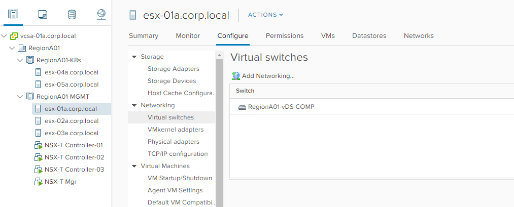
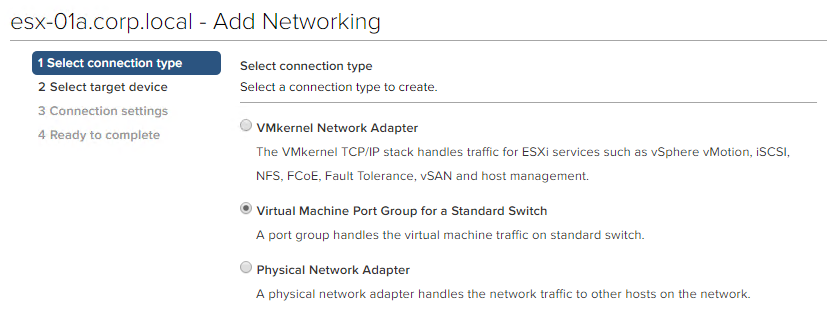
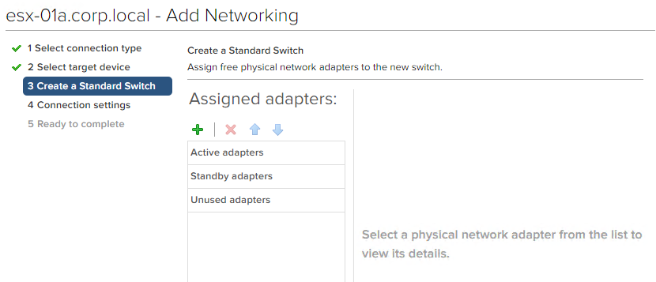
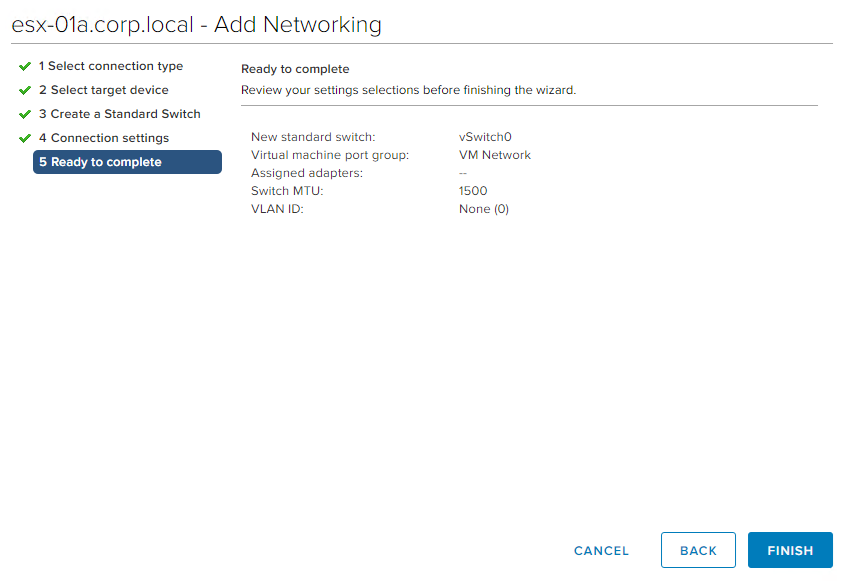

## Adding *VM Network*

Thanks to Niran Even Chen Twitter: [@NiranEC](https://twitter.com/NiranEC) for the detailed notes

The ESXi servers where the OVAs get deployed is required to have a default `VM Network` port group.
This is due to a bug with the Ovftool that the pipeline is utilizing. Users would get an error about `Host did not have any virtual network defined` and ovftool would fail to deploy the NSX Edges on the NSX-T management plane. 

If you don’t have the `VM Network`, set up a VSS port group as detailed below. 

* Create a “VM network” VSS port group in each server in the management cluster, no NICS are required to be attached to that.
* In the vCenter client highlight the ESXi server and click Configure -> Virtual Switches -> Add networking:

* Select `Virtual Machine Port Group for a Standard Switch`

* Select `New Standard Switch`

* No Adapters are needed. Click Next.

* Click next to have `VM Network` port group
* Submit Changes

* Repeat steps for all the other ESXi hosts that need to be part of the transport nodes.